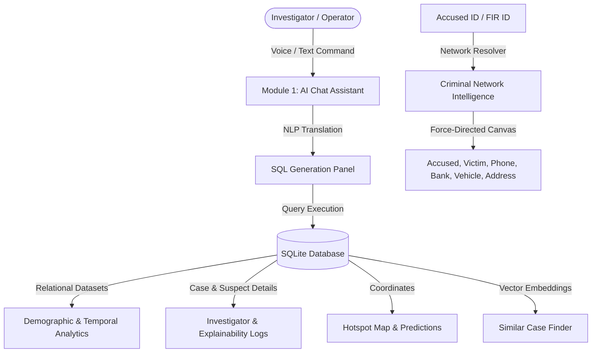

# 🛡️ Rakshak AI — Intelligent Crime & Threat Forecasting Platform

Rakshak AI is a state-of-the-art cyber-defense command center designed for police intelligence agencies. It integrates demographic crime analytics, criminal network graphing, geospatial hotspot mapping, sociological insights, vector-similarity case finders, AI conversational search, and explainable decision paths.

---

## 🗺️ System Architecture



---

## ⚡ Key Tactical Modules

### 🤖 1. AI Conversational Crime Assistant
* **Voice Search**: Browser-native SpeechRecognition supporting both English and ಕನ್ನಡ (Kannada) voice commands.
* **Verbal Responses**: Text-to-speech output using standard SpeechSynthesis.
* **SQL Transparency**: Live query logging panel showcasing the exact SQLite commands running under the hood.
* **Beautiful PDF Export**: One-click download of the complete investigation transcript formatted into a structured PDF dossier.

### 🕸️ 2. Criminal Network Link Analysis
* **Dynamic Node Graphs**: Interactive visual links connecting Accused, Victims, Locations, Vehicles, Bank Accounts, and Phones.
* **AI Detective Mode**: Highlights cross-case commonalities (shared vehicles, gang alignments, shared banking transactions).

### 📊 3. Crime Pattern Analytics
* **Temporal Tracking**: Interactive line and area charts mapping crime variations by Year, Month, Weekday, and hour of day.
* **Demographic Cohorts**: Stacked bar charts separating offender categories by gender and age brackets.
* **Seasonal & Weather Filters**: Compares incident rates against weather variables and festival calendar spikes.

### 🗺️ 4. Geospatial Hotspot Mapping
* **Incident Map**: Leaflet-driven geographic maps color-coded by incident severity (Red: High, Orange: Medium, Green: Low).
* **Predictive Patrols**: Identifies hotspot predictions for the upcoming week based on historic temporal density.

### 🔍 5. Similar Case Finder
* **Natural Language Vectors**: Similarity vector analysis comparing incident statements against historic FIR logs.
* **Justification Matrix**: Displays percentage matches accompanied by bulleted MO (Modus Operandi) correlation reasons.

### 👤 6. Offender Profiling & Threat Scoring
* **Risk Radar**: 5-axis threat score (Frequency, Recency, Severity, Network size, and Repeat offence history) shown on Accused Profiles.

### 🧠 7. Sociological Insights
* Grouped bar charts mapping juvenile crime trends, educational status, and income correlations to crime rates.

### 📋 8. Investigator Assistant & AI Timelines
* Automated `CrimeNo` calculations, chronological visual timelines from filing to chargesheet, and next-step actions recommended by the AI.

### 🔮 9. Crime Forecasting
* Machine Learning probabilities (XGBoost / Random Forest) forecasting the likelihood of specific crime types occurring in a district next week.

### ⚖️ 10. Explainable AI (XAI)
* In-depth collapsible decision trees explaining the rationale, confidence levels, and ground-truth sources behind AI risk forecasts.

### 🔑 11. Role-Based Clearance Auth
* Granular access control for **Admin**, **Investigator**, **Analyst**, **Supervisor**, and **Policy Maker** with custom visual metrics tailored to each role.

---

## 🛠️ Technology Stack

* **Frontend**: React, NextJS Router, TailwindCSS, Framer Motion, Recharts, Leaflet Mapping.
* **Backend**: Node.js, Express, Drizzle ORM, SQLite.
* **Security & Auth**: Role Guards, JWT Signatures.

---

## 💻 Local Setup & Development

### 1. Install Dependencies
```bash
pnpm install
```
*(If deploying on standard npm environments, standard `npm install` is fully supported).*

### 2. Start the Development Servers
```bash
pnpm dev
```
The client portal will be available at: **http://localhost:5173**

### 3. Run Production Build
```bash
npm run build
```

---

## 🔑 Officer Clearance Logins

To login, navigate to **[http://localhost:5173/login](http://localhost:5173/login)** and use the following officer credentials:

| Clearance Level | Officer ID (Username) | Clearance Code (Password) | Officer Profile |
| :--- | :--- | :--- | :--- |
| **ADMIN** | `KSP-0001` | `admin000` | System Admin Officer |
| **INVESTIGATOR** | `KSP-8492` | `investigator123` | Investigator O.P. Singh |
| **ANALYST** | `KSP-3741` | `analyst456` | Analyst A.K. Sharma |
| **SUPERVISOR** | `KSP-5591` | `supervisor789` | Supervisor R.S. Patil |
